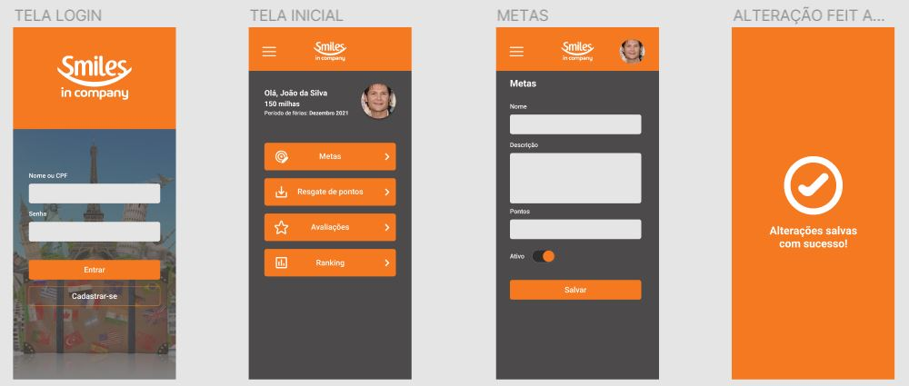

# 
SMILES in Company

## 💡 Proposta
<i>Solução B2B para incentivar os colaboradores utilizando pontos SMILE. Usando esse app você terá acesso a:</i>
- Metas
- Resgate de Ponto
- Avaliações
- Ranking
  
### Melhora a satisfação do colaborador:
- Facilidade e confiabilidade na hora de escolher os voos
- Benefícios diretos em pontos e experiências SMILES 

## 🤝 Diferenciais
### Seu colaborador muito mais focado
- <b>App exclusivo</b>: Permite visualizar metas e pontos conquistados, em um só lugar
- <b>Planejamento e Acompanhamento</b>: Permite ao colaborador traçar metas e acompanhar usa evolução.

## Telas

## ⚙ Tecnologias

- [React](https://reactjs.org/)
- [React Native](https://reactnative.dev/)
- [Typescript](https://www.typescriptlang.org/)
  

 ## 💪 Time
  - Daniel Leite (Designer)  [LinkedIn](https://www.linkedin.com/in/daniel-leite-aa17b843/) . [Behance](https://www.behance.net/danielrodrigo)
  - Léo Morais (Business) [LinkedIn](https://www.linkedin.com/in/leohmoraes/)
  - Everton Ferreira (Dev) [LinkedIn](https://www.linkedin.com/in/evertonferreira96/)
  - Vinicius Passos (Dev) [LinkedIn](https://www.linkedin.com/in/vtpa/) . [GitHub](https://github.com/vtpa)